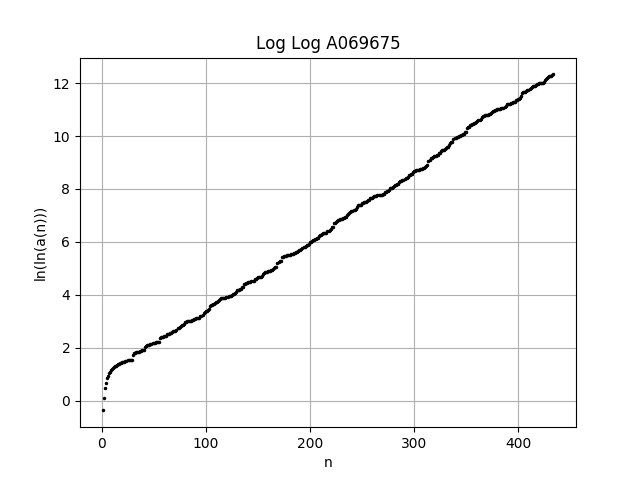

[A069675](https://oeis.org/A069675)
---

### Background

I initially discovered A069675 as part of some Project Euler and took up the task of increasing the known bounds. In 2016 time Charles R Greathouse IV and Robert Israel had calculated up to a(300). I've extended this to a(434) and hope to eventually find a(450) which is likely to be around 10<sup>150,000</sup>

The code runs in two steps

1. Sieve all tuples `(a, b, d) = a * 10^d + b` with primes up to X million (10,000M for d <= 100,000).
1. gmp is_prime on all remaining pairs in parallel with checkpoints.


The largest run I've completed is `d <= 100,000` with an initial sieve of `primes <= 10B`.

```
git clone https://github.com/sethtroisi/OEIS
cd OEIS/A069675
git submodule update --init --recursive

sudo apt-get update
sudo apt-get install libgmp-dev

mkdir -p build
cd build

cmake ..
cmake --build . -- -j4

time ./sieve
time ./tester
```

### Results
---

`python A069675_helper.py` provides estimates of a(n), a guess at the optimal sieve size, and estimated wall time.

|n|a(n)|
|----|----:|
|1|2|
|2|3|
|25|97|
|50| 7 * 10^3 + 1 |
|100| 7 * 10^12 + 9 |
|150| 6 * 10^45 + 1 |
|200| 5 * 10^175 + 3 |
|250| 5 * 10^757 + 9 |
|300| 7 * 10^2559 + 3 |
|350| 4 * 10^11293 + 3 |
|400| 7 * 10^38079 + 3 |
|410| 3 * 10^55077 + 7 |
|420| 9 * 10^70500 + 1 |
|430| 7 * 10^91215 + 3 |
|431| 9 * 10^91836 + 1 |
|432| 1 * 10^92691 + 9 |
|433| 4 * 10^94286 + 9 |
|434| 1 * 10^98288 + 3 |



